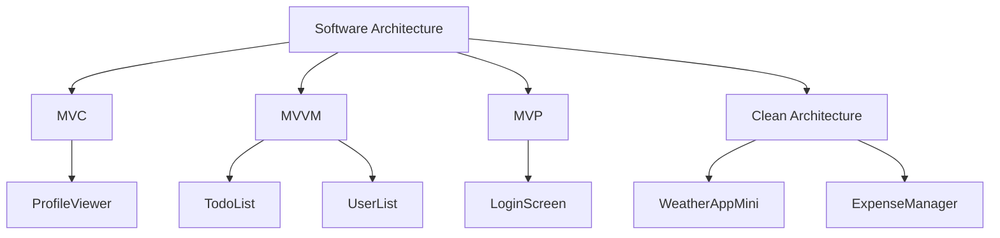

<h1 align="center">
  
</h1>

  
**Crafting beautiful, performant mobile applications with passion and precision**

## 🎯 About Me

📛 **Name**: Nguyen Thanh Dat  
🎯 **Role**: Mobile & Frontend Developer

❤️ **Passions**:  
   • Building clean, scalable applications  
   • Exploring modern software architectures  
   • Creating intuitive user experiences  
   • Optimizing for peak performance  

🎯 **Current Focus**:  
   • Swift & SwiftUI Mastery  
   • Flutter Cross-Platform Development  
   • React Frontend Development  
   • Clean Architecture Patterns  

💭 **Philosophy**: "Code with purpose, design with passion"  

🛠 **Tech Stack**: Swift, SwiftUI, Flutter, Dart, React, JavaScript  

🏗 **Architecture Patterns**: MVVM, MVC, MVP, Clean Architecture, VIPER  

📬 **Contact**:  
• Email: Catluong801@gmail.com  
• LinkedIn: [Nguyen Thanh Dat](https://linkedin.com/in/nguyen-thanh-dat-709811284)  
• GitHub: [NguyenThanhDat2004](https://github.com/NguyenThanhDat2004)

## 🛠 Tech Stack

### 📱 Mobile Development

| Platform | Technologies |
|----------|-------------|
| **iOS Native** |   |
| **Cross-Platform** |   |
| **Android** |  |

### 🌐 Frontend Development

### 💻 Backend & Databases

### 🛠 Development Tools

---

## 🚀 Featured Projects

### 📱 Mobile Applications

| Project | Tech Stack | Description | Status |
|---------|------------|-------------|---------|
| **🗒️ Note Taking App** | `SwiftUI` `CoreData` `Clean Architecture` | Full CRUD with search & persistent storage | ✅ Live |
| **🌤️ Weather App Mini** | `SwiftUI` `REST API` `Async/Await` | Real-time weather data with beautiful UI | ✅ Live |
| **🧾 Expense Manager** | `SwiftUI` `UserDefaults` `Charts` | Track and visualize daily expenses | ✅ Live |
| **✅ Todo List** | `Flutter` `MVVM` `Provider` | Cross-platform task management | ✅ Live |
| **💬 Quotes App** | `Flutter` `Provider` `Animations` | Inspirational quotes with dark mode | ✅ Live |

---

## 🏗 Architecture Expertise

### 📚 Pattern Overview
- **MVC**: Traditional separation with clear responsibilities
- **MVVM**: Reactive data binding with SwiftUI/Combine
- **MVP**: Enhanced testability and view abstraction  
- **Clean Architecture**: Domain-driven, testable, and scalable

---

## 📊 GitHub Analytics

<!-- GitHub Stats Cards -->

 

<!-- GitHub Trophy -->

 

<!-- Most Used Languages -->

---

## 📫 Let's Connect

### 🎉 Get In Touch

 

**"Turning ideas into elegant digital solutions, one line of code at a time."**

  <strong>🗒️ Note Taking App</strong> 
  <code>SwiftUI</code> <code>CoreData</code> <code>Clean Architecture</code> 
  Full CRUD with search & persistent storage ✅ Live

